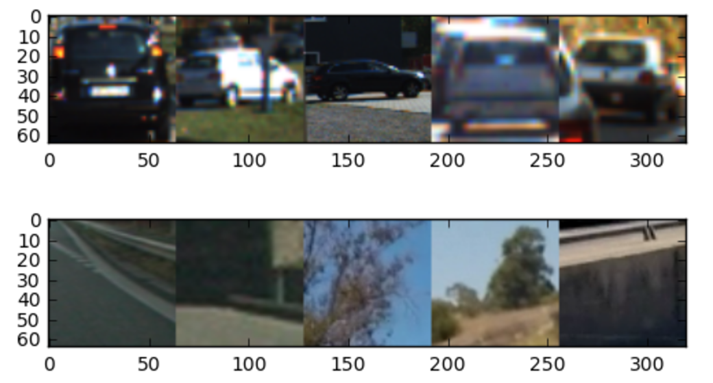

# Vehicle Detection Project

#### By: [Eqbal Eki](http://www.eqbalq.com/)

****
This project goal is to write a software pipeline to detect vehicles in a video.  This is a project for 
[](http://www.udacity.com/drive).

We can use one of the two approaches to solve this problem:

- **Classification** problem: 

  The image are divided into small patches, each of which will be run through a classifier to determine whether there are objects in the patch. Then the bounding boxes will be assigned to locate around patches that are classified with high probability of present of an object. The steps for this approaches are:

  - A Histogram of Oriented Gradients (HOG) feature extraction on a labeled training set of images and train a Linear SVM classifier.
  - A color transform and binned color features, as well as histograms of color, to combine the HOG feature vector with other classical computer vision approaches
  - A sliding-window technique to search for cars with the trained SVM
  - Creating a heatmap of recurring detections in subsequent framens of a video stream to reject outliers and follow detected vehicles.

- **Regression** problem using [YOLO](https://pjreddie.com/darknet/yolo/).

  Here, the whole image will be run through a convolution neural network (CNN) to directly generate one or more bounding boxes for objects in the images. The steps can be briefed below:

  - Regression on the whole image to generate bounding boxes.
  - Generate bounding box coordinates directly from CNN

In this project, I'll be using both techniques, in Classification one, we will be able to lower the false positives further. Once I'm done, I'll be using Regression with YOLO and compare the results.

##Files:

  - `ObjectDetectionNet`:
    - CNN network to use the Regression tp detect object.

  - `Dataset`:
    - Splits the data into training, validation and test set and prepare the data.

  - `HOGClassifier`: 
    - Trains an SVM to detect cars and non-cars. It extracts HOGs features too.

  - `SearchClassify`: 
    - Implements a sliding window search for cars, including false positive filtering and applies the classifier to a video

  - `Playground.ipynb`:
    - Where I run the previous two classes to train the data and test it out

  - `helpers.py`:
    - I has all the helpers methods we got in the class 


## Classification:

###Steps:

- Perform a Histogram of Oriented Gradients (HOG) feature extraction on a labeled training set of images and train a classifier Linear SVM classifier
- Optionally, you can also apply a color transform and append binned color features, as well as histograms of color, to your HOG feature vector. 
- Note: for those first two steps don't forget to normalize your features and randomize a selection for training and testing.
- Implement a sliding-window technique and use your trained classifier to search for vehicles in images.
- Run your pipeline on a video stream (start with the test_video.mp4 and later implement on full project_video.mp4) and create a heat map of recurring detections frame by frame to reject outliers and follow detected vehicles.
- Estimate a bounding box for vehicles detected.

###[Rubric](https://review.udacity.com/#!/rubrics/513/view):

#### Data Exploration

I'm using the data from udacitys `Vehicle Detection and Tracking` project. The images provided (car and non car) shoulb be placed in ../data/vehicles/ and ../data/non-vehicles/.

I'm using `Dataset` class to do the parsing and splitting data to validation and training sets. 

```python
from dataset import Dataset

dataset = Dataset()
dataset.call()
dataset.inspect()
```

```
X_train shape: (14208, 64, 64, 3)
14208 train samples
3552 test samples
8792 images of vehicles
8968 images of non vehicles
```

All images are 64x64 pixels. A third data set released by Udacity was not used here. 

In total there are `8792` images of vehicles and `8968` images of non vehicles. Thus the data is somehow balanced. 

The quantity and quality of these sample images is critical to the process. Bad quality images will make the classifier do wrong predictions.

These data are separated in training (80%) and validation sets (20%), and their order is randomized.

Check out below 5 random samples for cars and non-cars images: 



#### Histogram of Oriented Gradients (HOG)

The HOG extractor is the heart of the method described here. It is a way to extract meaningful features of a image. It captures the general aspect of cars, not the specific details of it. It is the same as we, humans do, in a first glance, we locate the car, not the make, the plate, the wheel, or other small detail.

HOG stands for (Histogram of Oriented Gradients). Basically, it divides an image in several pieces. For each piece, it calculates the gradient of variation in a given number of orientations. Example of HOG detector — the idea is the image on the right to capture the essence of original image.

My code for extracting features in `HOGClassifier` class. 

I used the following params in my class (trial and error approach):

```
color_space = 'HLS'
spatial_size = (16, 16)
hist_bins = 32
orient = 9
pix_per_cell = 8
cell_per_block = 2
hog_channel = 'ALL'
spatial_feat = True
hist_feat = True
hog_feat = True
``` 

As you can see, I used HLS space and a low value of pixels_per_cell=(8,8). Using larger values of than orient=9 did not have a striking effect and only increased the feature vector. Similarly, using values larger than cells_per_block=(2,2) did not improve results.


#### Sliding Window Search

#### Video Implementation

## Regression

## Conclusion & Discussion

