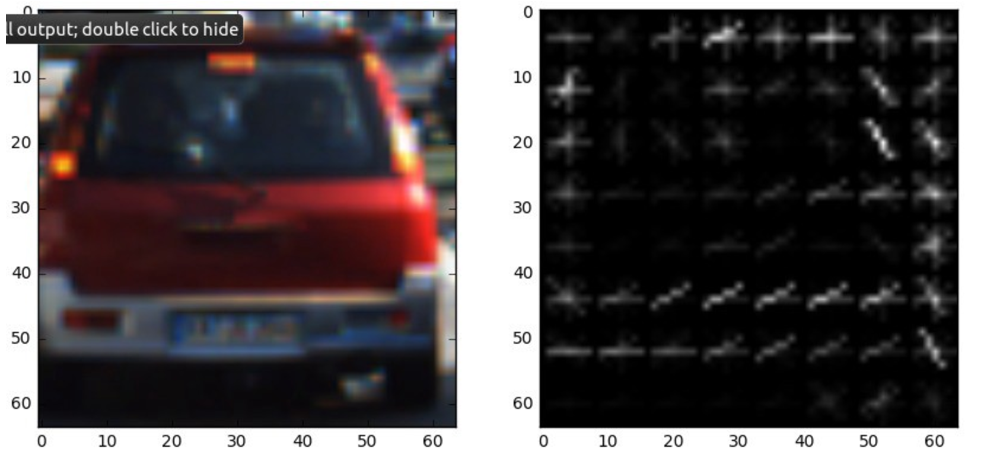
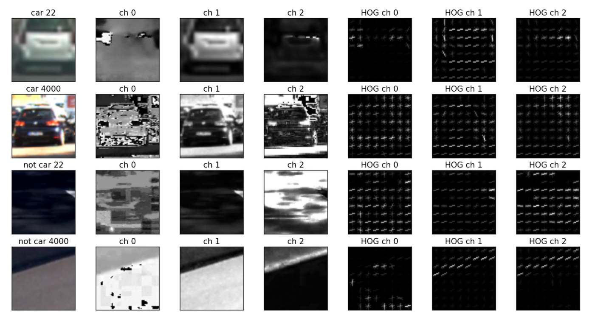
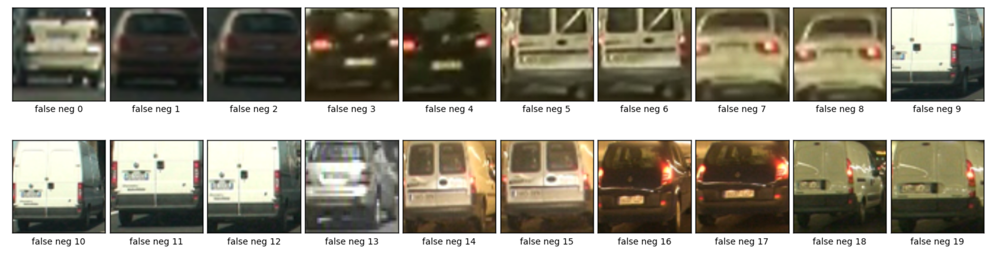
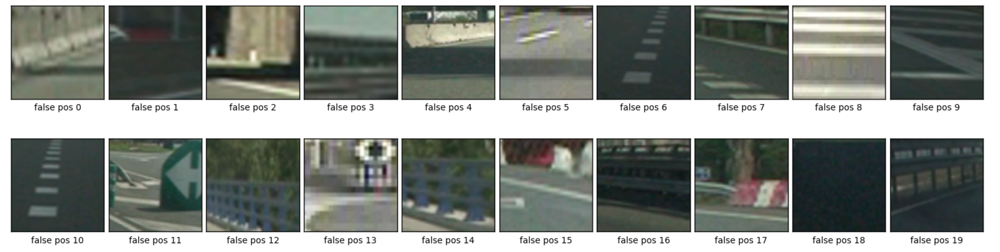
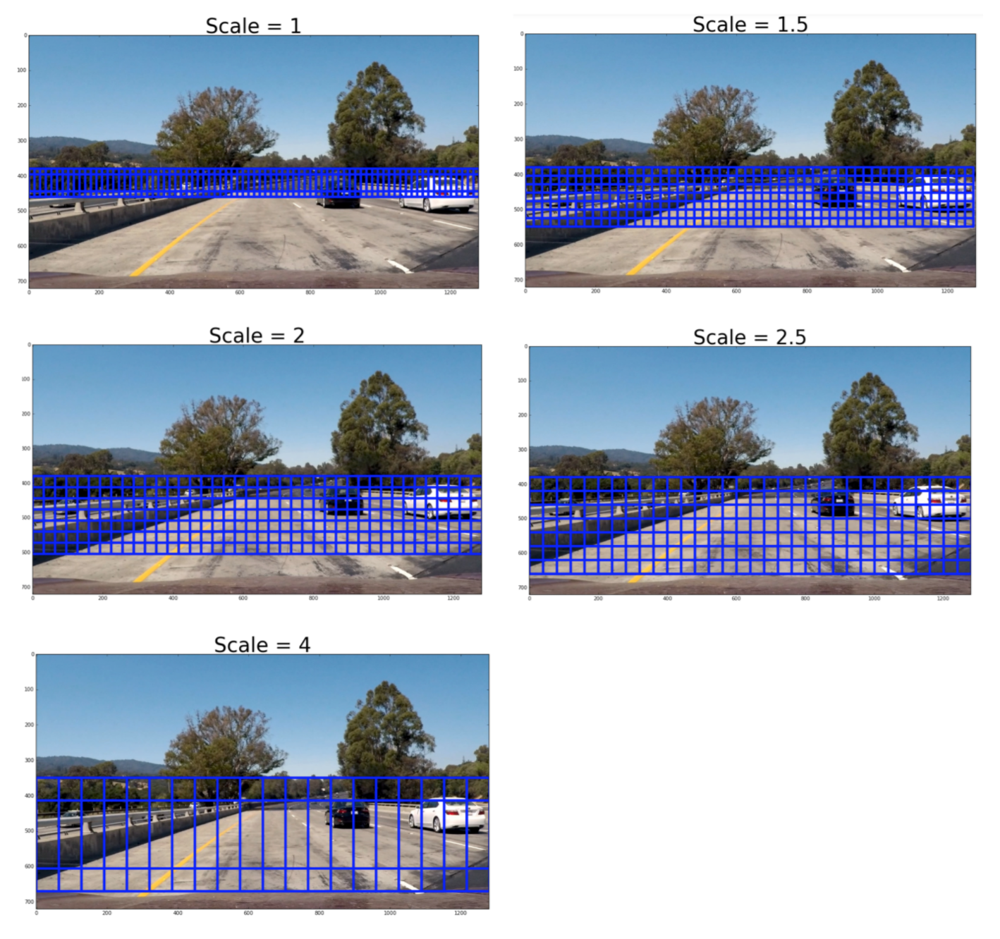
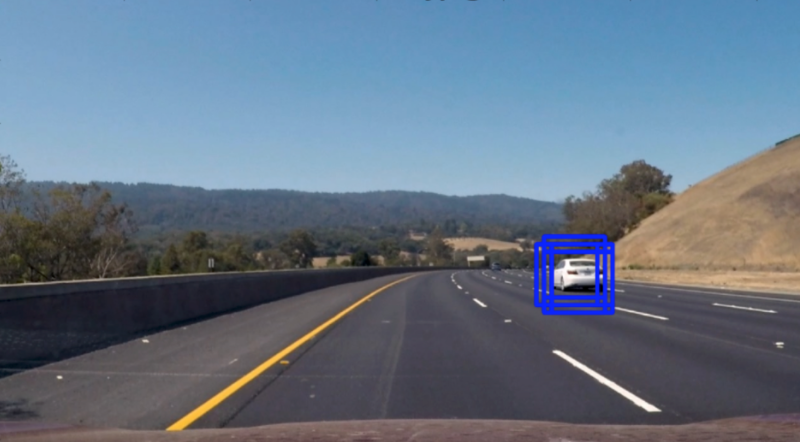
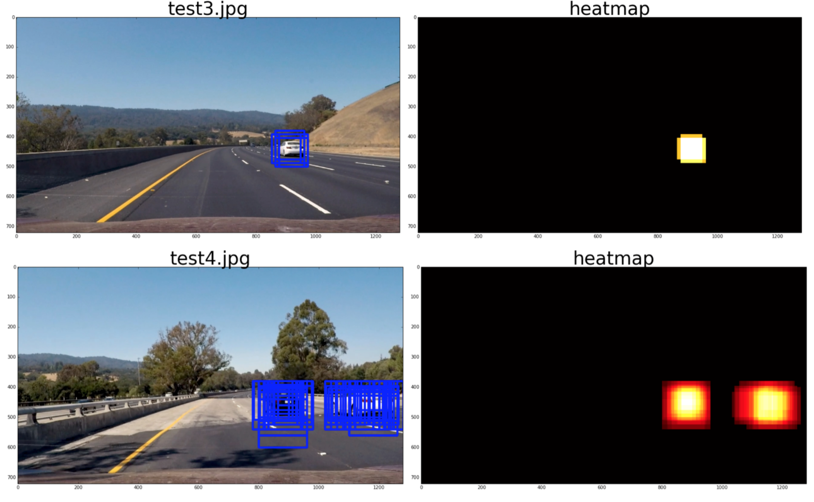
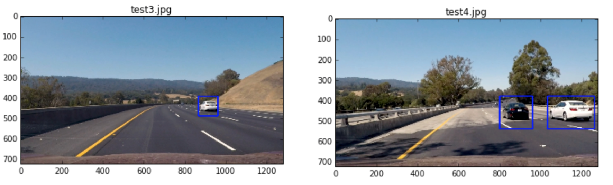

# Vehicle Detection Project

#### By: [Eqbal Eki](http://www.eqbalq.com/)

****
This project goal is to write a software pipeline to detect vehicles in a video.  This is a project for 
[](http://www.udacity.com/drive).

We can use one of the two approaches to solve this problem:

- **Classification** problem: 

  The image are divided into small patches, each of which will be run through a classifier to determine whether there are objects in the patch. Then the bounding boxes will be assigned to locate around patches that are classified with high probability of present of an object. The steps for this approaches are:

  - A Histogram of Oriented Gradients (HOG) feature extraction on a labeled training set of images and train a Linear SVM classifier.
  - A color transform and binned color features, as well as histograms of color, to combine the HOG feature vector with other classical computer vision approaches
  - A sliding-window technique to search for cars with the trained SVM
  - Creating a heatmap of recurring detections in subsequent framens of a video stream to reject outliers and follow detected vehicles.

- **Regression** problem using [YOLO](https://pjreddie.com/darknet/yolo/).

  Here, the whole image will be run through a convolution neural network (CNN) to directly generate one or more bounding boxes for objects in the images. The steps can be briefed below:

  - Regression on the whole image to generate bounding boxes.
  - Generate bounding box coordinates directly from CNN

In this project, I'll be using both techniques, in Classification one, we will be able to lower the false positives further. Once I'm done, I'll be using Regression with YOLO and compare the results.

##Files:

  - `ObjectDetectionNet`:
    - CNN network to use the Regression tp detect object.

  - `Dataset`:
    - Splits the data into training, validation and test set and prepare the data.

  - `HOGClassifier`: 
    - Trains an SVM to detect cars and non-cars. It extracts HOGs features too.

  - `SearchClassify`: 
    - Implements a sliding window search for cars, including false positive filtering and applies the classifier to a video

  - `WindowsSearch`:
    - Implements the search over all zones and windows.

  - `ImageProcessor`:
    - Pipeline to process images, apply heatmap and threshold

  - `Playground.ipynb`:
    - Where I run the previous two classes to train the data and test it out

  - `helpers.py`:
    - I has all the helpers methods we got in the class 

* Note: I'm using EC2 t2.large instance type with GPU for my training and running my tests.

## Classification:

###Steps:

- Perform a Histogram of Oriented Gradients (HOG) feature extraction on a labeled training set of images and train a classifier Linear SVM classifier
- Optionally, you can also apply a color transform and append binned color features, as well as histograms of color, to your HOG feature vector. 
- Note: for those first two steps don't forget to normalize your features and randomize a selection for training and testing.
- Implement a sliding-window technique and use your trained classifier to search for vehicles in images.
- Run your pipeline on a video stream (start with the test_video.mp4 and later implement on full project_video.mp4) and create a heat map of recurring detections frame by frame to reject outliers and follow detected vehicles.
- Estimate a bounding box for vehicles detected.

###[Rubric](https://review.udacity.com/#!/rubrics/513/view):

#### Data Exploration

I'm using the data from udacitys `Vehicle Detection and Tracking` project. The images provided (car and non car) shoulb be placed in ../data/vehicles/ and ../data/non-vehicles/.

I'm using `Dataset` class to do the parsing and splitting data to validation and training sets. 

```python
from dataset import Dataset

dataset = Dataset()
dataset.call()
dataset.inspect()
```

```
X_train shape: (14208, 64, 64, 3)
14208 train samples
3552 test samples
8792 images of vehicles
8968 images of non vehicles
```

All images are 64x64 pixels. A third data set released by Udacity was not used here. 

In total there are `8792` images of vehicles and `8968` images of non vehicles. Thus the data is somehow balanced. 

The quantity and quality of these sample images is critical to the process. Bad quality images will make the classifier do wrong predictions.

These data are separated in training (80%) and validation sets (20%), and their order is randomized.

Check out below 5 random samples for cars and non-cars images: 


#### Histogram of Oriented Gradients (HOG)

The HOG extractor is a way to extract meaningful features of a image. It captures the general aspect of cars, not the specific details of it. It is the same as we, humans do, in a first glance, we locate the car, not the make, the plate, the wheel, or other small detail.

HOG stands for (Histogram of Oriented Gradients). Basically, it divides an image in several pieces. For each piece, it calculates the gradient of variation in a given number of orientations.



You can find the code for extracting features in `HOGClassifier` class, method `extract_data_features`. 

I used the labeled data set [vehicles](https://s3.amazonaws.com/udacity-sdc/Vehicle_Tracking/vehicles.zip) and [non-vehicles](https://s3.amazonaws.com/udacity-sdc/Vehicle_Tracking/non-vehicles.zip) to extract the HOG features. 

I ended wup with the following params for the HOG extractor (trial and error approach):

```
color_space = 'YCrCb'
spatial_size = (16, 16)
hist_bins = 32
orient = 9
pix_per_cell = 8
cell_per_block = 2
hog_channel = 'ALL'
spatial_feat = True
hist_feat = True
hog_feat = True
``` 

I tried different color spaces, such as, HLS, HSV, YCrCb and found that YCrCb generated the best result when I tried using the trained model to detect vehicles in the test images.

Also, I tested 0,1,2 and 'All' HOG channels and found that 0 performed the worst. 1 & 2 performed well with the validation set with accuracy > 0.98 but bad when detecting vehicles in the test images.

There were a lot of false positives. I found that "All" performed well with the validation set with accuracy = 0.9462 but very well when detecting vehicles in the test images. Not much false positives were found. Therfore, i decided to use all 3 channels for HOG features



I used a low value of pixels_per_cell=8. Using larger values of than orient=9 did not have a striking effect and only increased the feature vector. Similarly, using values larger than cells_per_block=2 did not improve results.

```
from hog_classifier import *
cla = HOGClassifier(dataset)
cla.extract_data_features()
```

```
82.67 Seconds to extract HOG features...
Feature vectors shape: (17760, 6108)
```

I used the `StandardScaler` to scale/normalize our training set (`HOGClassifier.scale_features()`). 


#### The SVC Classifier

Again, most of the code for this section can be found in `HOGClassifier` class.

The next step was to train a classifier. It receives the cars / non-cars data transformed with HOG detector, and returns if the sample is or is not a car.

In this case, I used a Support Vector Machine Classifier (SVC), with linear kernel, based on function SVM from scikit-learn.

To train my SVM classifier, I used all channels of images converted to YCrCb space.

I included spatial features color features as well as all three YCrCb channels, because using less than all three channels reduced the accuracy considerably. 

The final feature vector has a length of `8460` elements, most of which are HOG features. 

For color binning patches of spatial_size=(16,16) were generated and color histograms were implemented using hist_bins=16 used.

Because there are a lot of time series data in the label data, I manually separated the vehicle and non-vehicle data into training and test set. I put the first 20% of vehicle data and non-vehicle data to the test set and the rest to the training set.

```
cla.scale_features()
cla.get_labels()
cla.split_up_data()
```

```
Using: 9 orientations 8 pixels per cell and 2 cells per block
Feature vector length: 6108
X_train shape: (14209, 6108)
14209 train samples
(14209, 6108) X_train.shape
(14209,) y_train.shape
(3551, 6108) X_test
(3551,) y_test shape
(17760, 6108) scaled_X shape
(17760,) y  shape
```

```python
cla.train()
# 18.98 Seconds to train SVC...
cla.accuracy()
# Test Accuracy of SVC =  0.9462

```

The average time for a prediction (average over a hundred predictions) turned out to be about 3.3ms on my macbook pro with i7 processor, thus allowing a theoretical bandwidth of 300Hz.

A realtime application would therfore only feasible if several parts of the image are examined in parallel in a similar time.

Using just the L channel reduced the feature vector to about a third, while test and validation accuracy dropped to about 94.5% each.

Despite the high accuracy there is a systematic error as can be seen from investigating the false positive detections.

Here is a sample of false negatives for car images: 



And here is a sample of false negatives for not cars images: 




#### Sliding Window Search

Up to now, we can feed a classifier with an 64 x 64 pixels image and get a result from it: car or non-car.

In order to do this in an entire image (720 x 1280), we use a sliding window.

First, I cropped just the interest region. Then sliced the image in small frames, resized it to the right size (64x64), and applied the classification algorithm we created in `hog_classifier.py`.

In `WindowsSearch` class I handle all the logic for sliding window search.

- I chose 5 sizes of the sliding window sizes with scales (1, 1.5, 2, 2.5 and 4) of default window 64 x 64. I originally didn't choose scale of 4 times bigger than 64 x 64 but found that the pipeline couldn't detect vehicles that were very close to the car.
- I set the cells per step to be 1 because it gave the best detection when i applied the heat map to remove false positives. And I added 1 more window to the right and to the bottom of the image so that it could detect the edge better.
- Also, I limited the area that each sliding window can search. Below shows the search area each sliding window would search for but please note that for illusation purposes I only included every other windows in the image.




```python
from windows_search import *

win_search  = WindowsSearch(cla.svc, cla.X_scaler)

image       = mpimg.imread("./test_images/test3.jpg")

draw_image  = np.copy(image)
hot_windows = win_search.find_cars(image)
draw_image  = draw_boxes(draw_image, hot_windows, color=(0, 0, 255), thick=6)

f, (ax1, ax2) = plt.subplots(1, 2, figsize=(24, 9))
f.tight_layout()

ax1.imshow(draw_image)
plt.show()

```



#### Video Implementation

I created `ImageProcessor` class as a pipeline on a video stream and create a heat map of recurring detections frame by frame to reject outliers and follow detected vehicles.

```python
class ImageProcessor():
    def __init__(self, win_search):
        self.win_search = win_search

    def call(self, image):
        draw_image = np.copy(image)

        heatmap = np.zeros((image.shape[0], image.shape[1]), np.uint8)

        hot_windows = self.win_search.find_cars(image)

        heatmap = add_heat(heatmap, hot_windows)

        heatmap = apply_threshold(heatmap,3)

        # Find final boxes from heatmap using label function
        labels = label(heatmap)

        # draw the bounding box on the image 
        draw_image = np.copy(image)
        draw_image = draw_labeled_bboxes(draw_image, labels)

        return draw_image
```

I ran the video stream through the pipeline and here are the examples of the vehicle detection and the corresponding heatmap.

Since the pipeline detected the vehicle pretty well, I created a heatmap for each frame and applied threshold = 3 to filter out any false positives.



After finding the heatmap, I applied the scipy.ndimage.measurements.label method to find the bounding boxes of the vehicles



```python

from image_processor import *
pipe = ImageProcessor(win_search)

from moviepy.editor import VideoFileClip
from IPython.display import HTML


output_file = 'test_video_out.mp4'
input_clip = VideoFileClip("test_video.mp4")
output_clip = input_clip.fl_image(pipe.call) 
%time output_clip.write_videofile(output_file, audio=False)
```

```

[MoviePy] >>>> Building video test_video_out.mp4
[MoviePy] Writing video test_video_out.mp4
 97%|█████████▋| 38/39 [01:14<00:01,  1.96s/it]
[MoviePy] Done.
[MoviePy] >>>> Video ready: test_video_out.mp4 

CPU times: user 1min 14s, sys: 124 ms, total: 1min 14s
Wall time: 1min 16s

```

#### Descussion

- The success of vehcile detection really depended on how good the trained classifier was. When I tried different input features and different classifiers, I found that there were a lot of false positives which made it very hard to detect the vehcile accurately. Once I found the input features and classifier to use, there were a lot less false positives.

- The time it took to process the video is too long. It is not possible to run this in real time scenario. I would probably try to reduce the number sliding windows that I used to do the vehicle detection and attain the same result.

- Some false positives still remain after heatmap filtering. This should be improvable by using more labeled data.

- The evaluation of feature vectors is currently done sequentially, but could easily be parallelized using some libraries

## Regression

## Conclusion & Discussion

